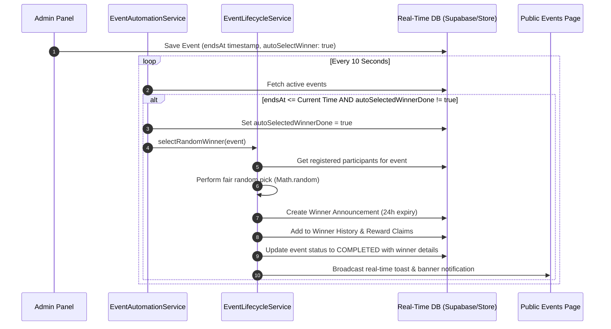

# ⚙️ LovePixels — 12-Module Admin CMS & Automation Blueprint

## 1. Authentication & Security Gatekeeper

Access to `/admin` is secured via PIN passcode validation (`passcode === "1234"` or `"lovepixels"`) and target Discord Admin handle verification (`nyx_str`, `w.arch`).

---

## 2. 12 CMS Modules Detailed Breakdown

Located in [`src/routes/admin.tsx`](file:///c:/Users/Administrator/Documents/Pixel%20Heart%20Studio/src/routes/admin.tsx):

| Tab Key | Module Title | Features & Actions |
| :--- | :--- | :--- |
| `overview` | Analytics Overview | Live stat metrics (Visitors, Total Events, Total Payouts, Active Staff) & recent audit trail log. |
| `homepage` | Homepage Customizer | Dynamically edit Hero Title, Subtitle, Community Notice Banner text, Live Member counters, and Discord Invite Link. |
| `staff` | Staff CMS | Add/Edit/Delete staff members. Fields: Full Name, `@handle` username input, Custom Role title (no default fallback!), Rank Category (`owner`, `co-owner`, `admin`, `moderator`, `helper`), Presence status, Bio, and Avatar Image Uploader. |
| `events` | Events CMS | Create/Edit/Delete events. Fields: Title, Description, Event Start Time (`datetime-local`), Event End Time (`datetime-local`), **⚡ Auto-Pick & Announce Winner** toggle, Prize Reward, Max Slots, Banner Image Uploader, and manual **🎲 Pick Winner Now** trigger button. |
| `claims` | Reward Claims CMS | Review incoming winner ticket claims. Approve payouts, enter payment method, upload proof screenshot, and complete claim. |
| `partners` | Partners CMS | Manage community partners, logos, tier levels (`Gold`, `Silver`, `Bronze`), perks, and custom invite links. |
| `gallery` | Gallery CMS | Upload and manage showcase artwork, titles, artist credits, categories, and image URLs. |
| `payouts` | Payout Proofs CMS | Add/Edit/Delete verified winner payout proofs, amounts, handles, payment dates, and proof receipts. |
| `reviews` | Reviews CMS | Moderate, approve, or create verified member reviews and star ratings. |
| `announcements` | Announcements CMS | Publish site-wide banner notices, alerts, and seasonal announcements. |
| `settings` | Global Settings | Maintenance mode toggle, website visibility, public registration toggle, and automatic review approval. |
| `audit` | Security Audit Logs | Real-time immutable audit trail recording every admin create, edit, or delete action with timestamp and actor name. |

---

## 3. Automated Winner Selection & Announcement Engine

### Workflow (`src/services/event-automation.service.ts` & `src/services/event-lifecycle.service.ts`):

---

## 4. Custom Drag-and-Drop Image Uploader (`CustomImageUploader.tsx`)

Features:
- Multi-file Drag & Drop zone.
- Canvas image compression using HTML5 Canvas (`src/lib/image-optimizer.ts`) before uploading.
- Real-time progress bar with percentage (`%`).
- Direct Supabase Storage bucket integration (`staff`, `events`, `proofs`, `gallery`, `partners`).
