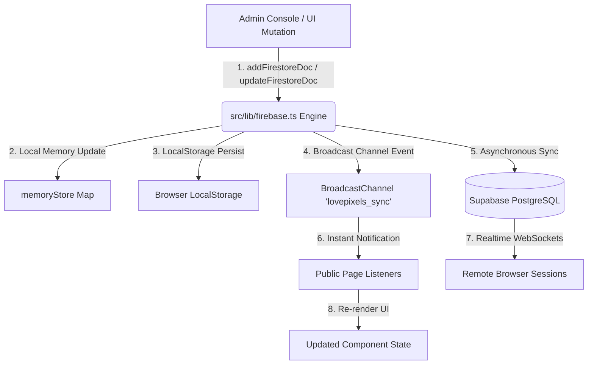

# 🏛️ LovePixels (Pixel Heart Studio) — Master System Blueprint

## 1. System Overview & Technology Stack

LovePixels is a production-grade, real-time community & creator showcase platform featuring a high-aesthetic glassmorphic UI, full real-time database synchronization via Supabase & local reactive broadcast channels, a 12-module Admin CMS, and an automated event & winner selection engine.

### Tech Stack Specifications:
- **Framework**: React 19 + TanStack Start (SSR & Client Routing) + Vite v8
- **Language**: TypeScript (Strict Mode)
- **Styling**: Tailwind CSS v4 + Vanilla CSS Custom Tokens + Dynamic Dark/Obsidian & Rose Switcher
- **Animations**: Framer Motion + Magnetic Hover Effects + Parallax Elements
- **Database & Real-time Layer**: Supabase PostgreSQL + Real-time WebSockets (`@supabase/supabase-js`) + Local Reactive Memory Store (`BroadcastChannel` & `localStorage`)
- **Authentication & Security**: Supabase Discord OAuth 2.0 + Role-Based Access Control (RBAC) + Audit Logging
- **UI Component Primitives**: Radix UI primitives + Lucide Icons + Sonner Glassmorphic Toasts

---

## 2. Codebase Directory Structure

```
Pixel Heart Studio/
├── AGENTS.md                   # Agent guidelines & project rules
├── package.json                # Project dependencies & scripts
├── vite.config.ts              # Vite & TanStack Start config
├── docs/                       # Project Documentation & Replication Guides
│   ├── master_blueprint.md
│   ├── database_and_schemas.md
│   ├── ui_and_design_system.md
│   ├── admin_cms_blueprint.md
│   └── ai_replication_guide.md
├── src/
│   ├── components/
│   │   ├── motion/             # FloatingCard, Magnetic, Parallax
│   │   ├── site/               # Site-wide presentational components
│   │   │   ├── Background.tsx
│   │   │   ├── ClaimRewardModal.tsx
│   │   │   ├── EventCard.tsx
│   │   │   ├── EventDetailsModal.tsx
│   │   │   ├── Footer.tsx
│   │   │   ├── GlobalSearchModal.tsx
│   │   │   ├── LandingHero.tsx
│   │   │   ├── LightboxModal.tsx
│   │   │   ├── Navbar.tsx
│   │   │   ├── NotificationDrawer.tsx
│   │   │   ├── ReviewCard.tsx
│   │   │   ├── ServerPreview.tsx
│   │   │   ├── StaffCard.tsx
│   │   │   ├── SubmitReviewModal.tsx
│   │   │   ├── WinnerAnnouncementCard.tsx
│   │   │   ├── WinnerCard.tsx
│   │   │   ├── WinnersMarquee.tsx
│   │   │   └── WinnersRibbon.tsx
│   │   └── ui/                 # Reusable UI primitives & CustomImageUploader
│   │       ├── CustomImageUploader.tsx
│   │       ├── sonner.tsx
│   │       └── ... (Radix-derived primitives)
│   ├── contexts/               # AuthContext, RBACContext
│   ├── hooks/                  # useAuth, useRBAC, useStorageUpload, useVisitorTracker
│   ├── lib/                    # Supabase client, Realtime Store, Image Optimizer, SEO
│   │   ├── firebase.ts         # Real-time Reactive Memory Store & Broadcast Sync Engine
│   │   ├── supabase.ts         # Supabase client & Storage Uploader
│   │   └── image-optimizer.ts  # HTML5 Canvas Client-side Compression
│   ├── models/                 # TypeScript Data Models
│   ├── repositories/           # Data Access Layer Repositories
│   ├── routes/                 # TanStack Start File-based Routes
│   │   ├── __root.tsx          # Root Layout & Theme Provider
│   │   ├── index.tsx           # Home Landing Page
│   │   ├── admin.tsx           # 12-Module Glassmorphic Admin CMS
│   │   ├── community.tsx       # Community & Giveaway Page
│   │   ├── events.tsx          # Live Events & Winner Claims Page
│   │   ├── gallery.tsx         # Creative Salons & Lightbox Page
│   │   ├── partners.tsx        # Affiliates & Partner Grid Page
│   │   ├── payouts.tsx         # Verified Proofs & Reviews Ticker Page
│   │   └── staff.tsx           # Staff Hierarchy Roster Page
│   ├── services/               # Business Logic Services
│   │   ├── auth.service.ts
│   │   ├── event-automation.service.ts
│   │   ├── event-lifecycle.service.ts
│   │   ├── notification.service.ts
│   │   └── xp.service.ts
│   └── styles.css              # Glassmorphic Utilities & Custom CSS Design Tokens
```

---

## 3. Real-Time Reactive Sync Architecture

The system uses a hybrid real-time synchronization strategy to guarantee instantaneous UI updates across multiple browser tabs and public pages when an admin edits content:



### Key Functions (`src/lib/firebase.ts`):
- `subscribeToCollection<T>(collectionName, defaultData, callback)`: Subscribes components to live collection state updates.
- `addFirestoreDoc(collectionName, data)`: Inserts new document, updates local state instantly, broadcasts event, and syncs to Supabase.
- `updateFirestoreDoc(collectionName, docId, updates)`: Modifies existing document, emits live update, and syncs.
- `deleteFirestoreDoc(collectionName, docId)`: Removes document and updates subscribers immediately.
